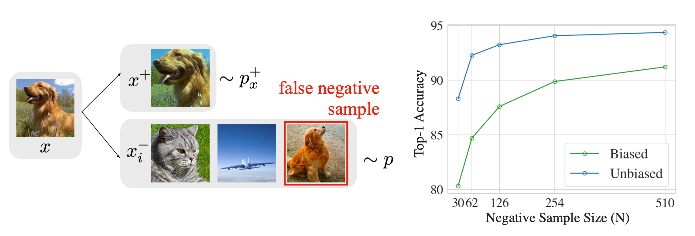
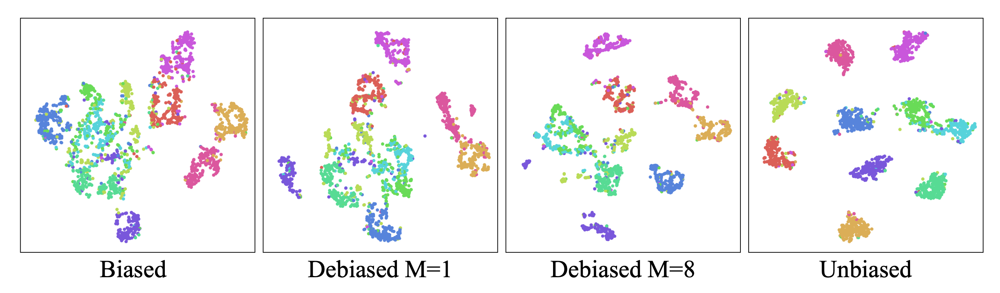
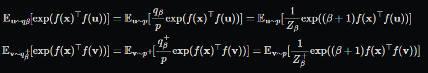
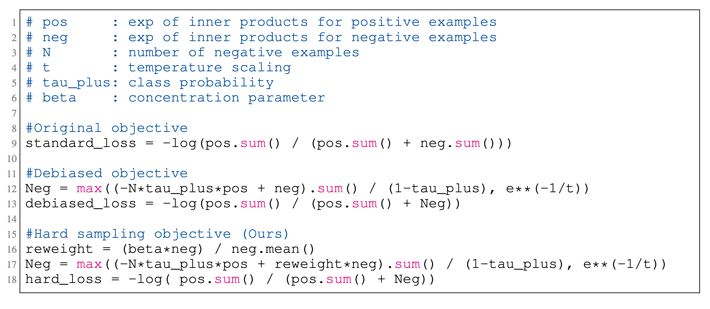
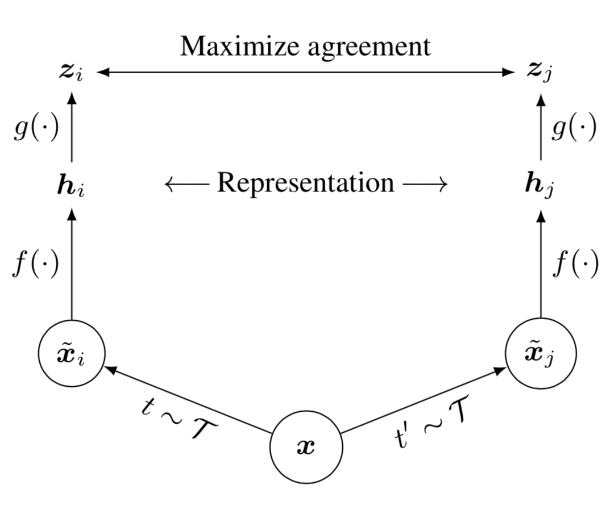
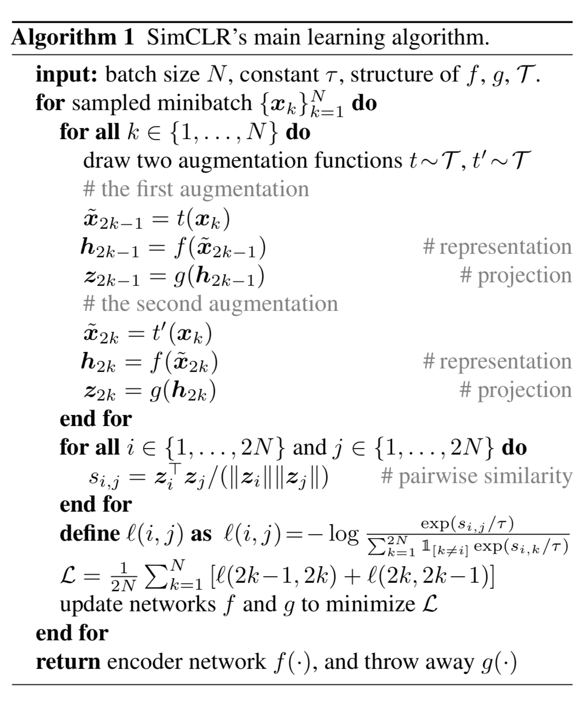
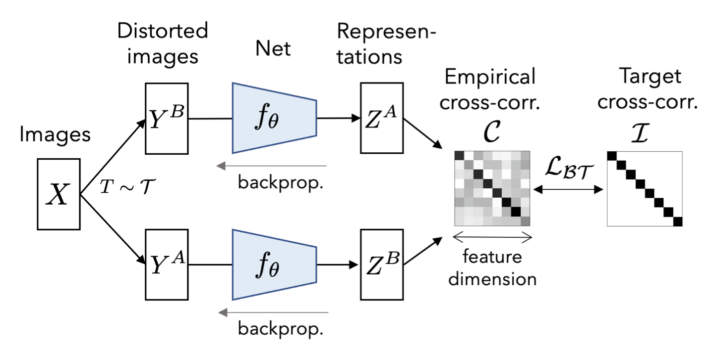
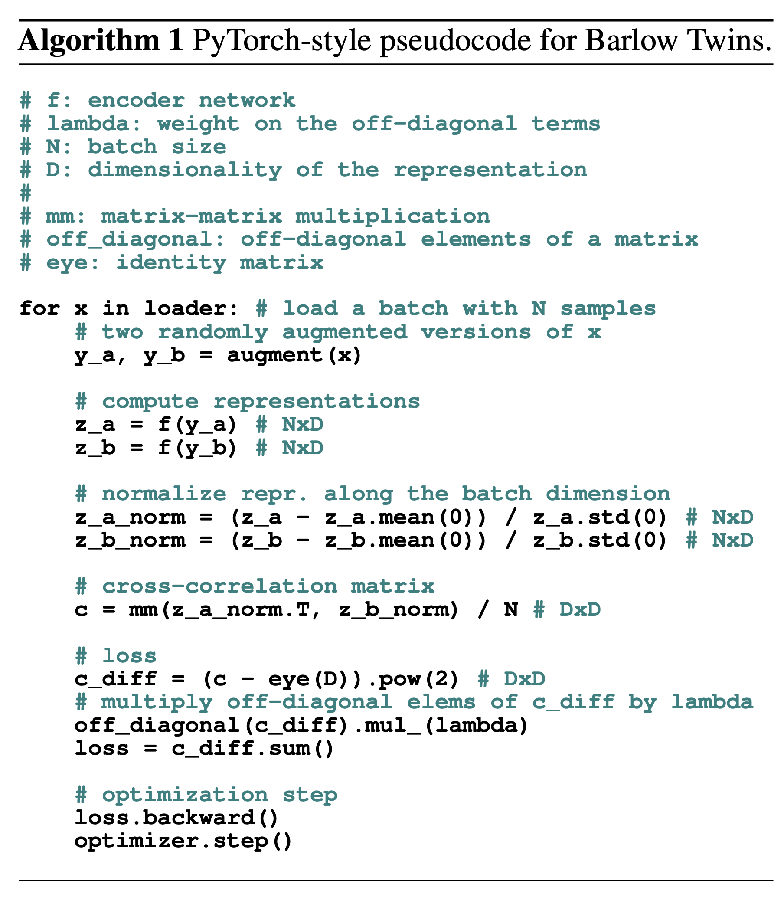
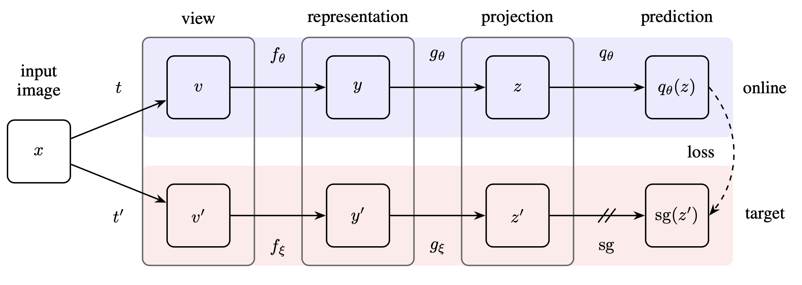

# 对比表征学习

对比表征学习的目标是去学习一种嵌入空间（embedding space），在该空间中，具有潜在相似性的样本对彼此相距较近，而不够相似的样本对彼此疏远。对比学习可以被应用于监督与无监督相关任务中。对于涉及到无监督数据的工作，对比学习是[自监督学习研究](https://lilianweng.github.io/posts/2019-11-10-self-supervised/)中最有效的方法之一。

## 对比学习的训练目标

早期用于对比学习的损失函数，只涉及到一个正样本和一个负样本。最近对于训练目标的设计趋势是**在一个训练batch中包含多个正负样本对**。

### 对比损失

对比损失是最早用于深度度量学习的训练目标函数之一。

已知一组输入样本$\{x_{i}\}$，每个样本都有一个对应的类别标签$y_i\in\{1,\dots,L\}$，类别范围为$L$个类内。我们希望学习一个函数$f_{\theta}(.):\chi\rightarrow\mathbb{R}^d$，该函数将$x_i$编码为嵌入向量（embedding vector），以使得来自相同类别的样本具有相似的嵌入形式（embedding），而来自不同类别的样本其形式尽可能不同。因此，对比损失获取一对输入$(x_i,x_j)$，当两者属于相同类别时最小化嵌入距离，否则便最大化。  

$L_{cont}(x_i,x_j,\theta)=\mathbb{1}[y_i=y_j]||f_\theta(x_i)-f_\theta(x_j)||_2^2+\mathbb{1}[y_i\neq y_j]max(0,\epsilon-||f_\theta(x_i)-f_\theta(x_j)||_2)^2$  

其中$\epsilon$是超参数，它定义了不同类的样本之间的下限距离。$\mathbb{1}$为指示函数。

### 三重损失（Triplet loss）

**三重损失**最初来源于FaceNet ([Schroff et al. 2015](https://arxiv.org/abs/1503.03832))，作者将其用于学习不同姿态与角度下相同行人的面部。

给定一锚点输入（anchor input）$x$，我们选择一个正样本$x^+$和一个负样本$x^-$，$x^+$表示其与$x$属于同一类，$x^-$表示属于其他类的样本。三重损失使用以下损失函数来**同时**学习最小化$x$与$x^+$的距离并最大化$x$与$x^-$的距离：    

$L_{triplet}(x,x^+,x^-)=\sum_{x\in\chi}max(0,||f(x)-f(x^+)||_2^2-||f(x)-f(x^-)||_2^2+\epsilon)$

其中参数$\epsilon$表示相似样本对与不相似样本对之间距离的最小偏移。  
要想提升模型性能，选择一个合适的负样本$x^-$非常重要。

### 提升结构损失（Lifted Structured Loss）
该损失函数（[Song et al. 2015](https://arxiv.org/abs/1511.06452)）利用了一个训练batch内的所有样本对之间的相关关系，获得了更好的计算效率。

定义$D_{ij}=|f(x_i)-f(x_j)|_2$，那么结构化的损失函数可被定义为：  
$L_{struct}=\frac{1}{2|P|}\sum_{(i,j)\in P}max(0,L_{struct}^{(ij)})^2$  
where $L_{struct}^{(ij)}=D_{ij}+ \color{red}{max( max_{(i,k)\in N} \ \epsilon-D_{ik}, max_{(j,l)\in N}\ \epsilon-D_{jl} )}$  
其中$P$为正样本对的集合，$N$为负样本对的集合。稠密样本对平方距离矩阵$D$的计算可以分解在每个训练batch之中。

$\color{red}{红色}$部分是用于挖掘难于分类的负样本（hard negatives）。但是其不够光滑，可能造成收敛到一个较差的局部最优。因此，可修改为：  
$L_{struct}=D_{ij}+log(\sum_{(i,k)\in N}exp(\epsilon-D_{ik})+\sum_{(j,l)\in N}exp(\epsilon-D_{jl}))$

该论文还提出给定几个随机正样本对，通过主动加入复杂负样本来增强每个batch负样本的质量。

### N-pair Loss

Multi-Class N-pair loss ([Sohn 2016](https://papers.nips.cc/paper/2016/hash/6b180037abbebea991d8b1232f8a8ca9-Abstract.html))对triplet loss进行泛化，其包含了与多个负样本的比较。

给定一个长$(N+1)$的训练样本元组，${x,x^+,x_1^-,...,x_{N-1}^-}$，该元组包含一个正样本和$N-1$个负样本，N-pair loss定义为：  

$L_{N-pair}(x,x^+,\{x_i^-\}_{i=1}^{N-1})=log(1+\sum_{i=1}^{N-1}exp(f(x)^Tf(x_i^-)-f(x)^Tf(x^+)))$

$=-log\frac{exp(f(x)^Tf(x^+))}{exp(f(x)^Tf(x^+))+\sum_{i=1}^{N-1}exp(f(x)^Tf(x_i^-))}$

如果我们对每个类别只采样一个负样本，它就等价于多类别分类的softmax损失。

### NCE

**Noise Contrastive Estimation**， 简称**NCE**，是一种用于估计统计模型参数的模型。该模型由[Gutmann 和 Hyvarinen](http://proceedings.mlr.press/v9/gutmann10a.html)于2010年提出。其思想是通过逻辑回归来区分噪声和目标数据。[了解更多](https://lilianweng.github.io/posts/2017-10-15-word-embedding/#noise-contrastive-estimation-nce)

令$x$为目标样本$\sim P(x|C=1;\theta)=p_{\theta}(x)$,并令$\~x$为噪声样本$\sim P(\~x|C=0)=q(\~x)$。
注意这里是从目标数据分布中对样本以逻辑回归形式建模，不是从噪声分布中建模：  

$l_{\theta}(u)=log\frac{p_{\theta}(u)}{q(u)}=logp_{\theta}(u)-logq(u)$

使用sigmoid函数将其转为概率，便可使用交叉熵进行优化：  

$L_{NCE}=-\frac{1}{N}\sum_{i=1}^{N}[log\sigma(l_{\theta}(x_i))+log(1-\sigma(l_{\theta}(\~x_{i})))]$

where $\sigma(l)=\frac{1}{1+exp(-l)}=\frac{p_{\theta}}{p_{\theta}+q}$

这里给出NCE loss 的原始部分是因为后续的改进也是将单正负样本改为单正样本多负样本。

### InfoNCE

**InfoNCE loss**受NCE启发，其使用分类交叉熵损失从一组不相关的噪声样本中识别出正样本。

给定一个上下文向量$c$，那么正样本可从条件分布$p(x|c)$中抽取出来，同时，可从$p(x)$中抽取出$N-1$个负样本，其中负样本独立于上下文向量$c$。简单来讲，我们将所有样本标注为$X=\{x_i\}_{i=1}^N$，其中只存在一个正样本$x_{pos}$。那么我们正确找到正样本的概率为：  

$p(C=pos|X,c)=\frac{p(x_{pos}|c)\prod_{i=1,\dots,N;i\neq pos}p(x_i)}{\sum_{j=1}^{N}[p(x_j|c)\prod_{i=1,\dots,N;i\neq j}p(x_i)]}=\frac{\frac{p(x_{pos|c})}{p(x_{pos})}}{\sum_{j=1}^N\frac{p(x_j|c)}{p(x_j)}}=\frac{f(x_{pos},c)}{\sum_{j=1}^Nf(x_j,c)}$

>$p(x_{pos})\prod_{i=1,\dots,N;i\neq pos}p(x_i)=1(必然事件)$

这里用$f(x,c)$表示$\frac{p(x|c)}{p(x)}$

InfoNCE loss优化正确分类正样本的负对数概率：  

$L_{InfoNCE}=-\mathbb{E}[log\frac{f(x,c)}{\sum_{x'\in X}f(x',c)}]$

$f(x,c)$估计密度比例$\frac{p(x|c)}{p(x)}$，这涉及到互信息优化。为了最大化输入$x$与上下文向量$c$之间的互信息，我们有：

$I(x;c)=\sum_{x,c}p(x,c)log\frac{p(x,c)}{p(x)p(c)}=\sum_{x,c}p(x,c)log\color{blue}{\frac{p(x|c)}{p(x)}}$

这里蓝色的对数项可由$f$估计得到。

对于序列预测任务，CPC不直接对未来观测$p_k(x_{t+k}|c_t)$进行建模，而是通过对密度函数建模来保存$x_{t+k}$与$c_t$之间的互信息：

$f_k(x_{t+k},c_t)=exp(z_{t+k}^TW_{kc_t})\propto \frac{p(x_{t+k}|c_t)}{p(x_{t+k})}$

>$\propto$为正比符号

$z_{t+k}$为被编码的输入，$W_k$是可训练的权重矩阵。

### Soft-Nearest Neighbors Loss

该损失函数从单正样本扩展到多个正样本。([Salakhutdinov & Hinton 2007](http://proceedings.mlr.press/v2/salakhutdinov07a.html), [Frosst et al. 2019](https://arxiv.org/abs/1902.01889))

给定一组样本，$\{(x_i,y_i)\}_{i=1}^B$，其中$y_i$是$x_i$的类别标签，函数$f(.,.)$用于度量两个输入的相似程度。位于温度系数$\tau$下的soft nearest neighbor loss定义为：

$L_{snn}=-\frac{1}{B}\sum_{i=1}^Blog\frac{\sum_{i\neq j, y_i=y_j,j=1,\dots,B}exp(-f(x_i,x_j)/\tau)}{\sum_{i\neq k, k=1,\dots,B}exp(-f(x_i,x_k)/\tau)}$

温度系数$\tau$调整表征空间中特征分布的疏密。想象一下胖瘦高斯分布。  
低温时，概率分布更紧凑。模型对负样本的关注会减少。

### 一般设定（Common Setup）

在软近邻损失（Soft Nearest-neighbor loss）中，我们可以适度放松对类别和标签的定义以在无监督的数据之外创造更多的正负样本对。比如，**应用数据增强来生成原始数据的噪声版本**。

>想到了GhostNet

目前大多数方法都遵循以下关于对比学习目标的定义来引入多种正负样本。通过[Wang & Isola 2020](https://arxiv.org/abs/2005.10242)中给出的步骤，令$p_{data}(.)$为$\mathbb{R}^n$域内的数据分布，$p_{pos}(.,.)$为$\mathbb{R}^{n\times n}$域内正样本对的分布。这两种分布应该满足以下条件：

* 对称性：$\forall x,x^+,p_{pos}(x,x^+)=p_{pos}(x^+,x)$
* 边缘匹配：$\forall x, \int p_{pos}(x,x^+)dx^+=p_{data}(x)$

为了学到一个能够学到*L2-normalized特征向量*的编码器$f(x)$，对比学习的目标为如下形式：

$L_{contrastive}=\mathbb{E}_{(x,x^+)\sim p_{pos},\{x_i^-\}_{i=1}^{Mi.i.d}\sim p_{data}}[-log\frac{exp(f(x)^Tf(x^+)/\tau)}{exp(f(x)^Tf(x^+)/\tau)+\sum_{i=1}^Mexp(f(x)^T)f(x_i^-)/\tau}]$

$\approx \mathbb{E}_{(x,x^+)\sim p_{pos},\{x_i^-\}_{i=1}^{M i.i.d}\sim p_{data}[-f(x)^Tf(x^+)/\tau+log(\sum_{i=1}^{M}exp(f(x)^Tf(x_i^-)/\tau))]}$

$=-\frac{1}{\tau}\mathbb{E}_{(x,x^+)\sim p_{pos}}f(x)^Tf(x^+)+\mathbb{E}_{x\sim p_{data}}[log\mathbb{E}_{x^-\sim p_{data}}[\sum_{i=1}^Mexp(f(x)^Tf(x_i^-)/\tau)]]$

>这里还是偏向单正样本与多负样本的优化关系

## 关键成分

### 大量数据增强

给定一训练样本，在计算其相关损失之前通常需要数据增强技术为该样本添加噪声。适度的数据增强设定对于学习一个优秀的，泛化性好的嵌入特征是至关重要的。其在不改变语义信息的同时将些微变量引入到样本之中，以此鼓励模型去学习表征的主要部分。比如，[SimCLR](https://lilianweng.github.io/posts/2021-05-31-contrastive/#simclr)中的实验表明随机裁剪和随机颜色失真对于学习图像的视觉表征是至关重要的。

### 大 Batch Size

对于很多依赖 batch 内负样本的对比方法（如[SimCLR](https://lilianweng.github.io/posts/2021-05-31-contrastive/#simclr)，[CLIP](https://lilianweng.github.io/posts/2021-05-31-contrastive/#clip)），它们能够成功的一个原因就是使用了大 batch size。只有当 batch size 足够大时，损失函数才能够覆盖足够多负样本，网络才能够学到能区分不同样本的重要表征。

### 复杂负样本挖掘

复杂的负样本应该具有与原始样本（anchor sample）不同的标签，但彼此的嵌入特征（embedding feature）需要尽可能的相似。在监督学习中，因为可以获取真实标签（ground truth），因此很容易区分任务专有的复杂负样本。比如当学习句式嵌入（sentence embedding）时，我们可以将标记为“矛盾”（contradiction）的句子对标记为复杂负样本对。

然而，当我们需要在无监督任务中操作时，对于复杂负样本的挖掘似乎成了一种trick。增加训练 batch size 或者 memory bank size 能够隐式得引入更多复杂负样本，但这可能导致对于大内存过度需求这一问题。

[Chuang et al. (2020)](https://arxiv.org/abs/2007.00224)对对比学习中的采样偏移现象进行了研究，并提出了去偏差损失。 在无监督中，我们是不知道真实标签的，因此可能存在误采样伪负样本的现象。这种采样偏差会极大的影响网络性能。  
  

我们假设 anchor class $c$ 的概率服从均匀分布$\rho(c)=\eta^+$，那么观测到其他类的概率为$\eta^-=1-\eta^+$.

* 对于观测样本$x$来说，其为正的概率为$p_x^+(x^{'})=p(x^{'}|h_{x^{'}}=h_x)$;
* 其为负的概率为$p_x^-(x^{'})=p(x^{'}|h_{x^{'}}\neq h_x)$;

当我们采样$x^-$时，没有办法获取真正的$p^-_x(x^-)$，因此存在某一概率$\eta^+$使得$x^-$错误的从锚类（anchor class）$c$中被采样。那么采样数据的实际分布就变成了：  

$p(x^{'})=\eta^+p_x^+(x^{'})+\eta^-p_x^-(x^{'})$

通过简单的公式变换，我们可以去除损失中的偏差：

$p_x^-(x^{'})=(p(x^{'})-\eta^+p_x^+(x^{'}))/\eta ^-$.

对于从$p$中采样的$N$个样本$\{u_i\}_{i=1}^N$，以及从$p_x^+$中采样的$M$个样本$\{v_i\}_{i=1}^M$，我们可以估计对比学习损失中分母的第二项的期望$\mathbb{E}_{x^-\sim p_x^-}[exp(f(x)^Tf(x^-))]$:

$g(x,\{u_i\}_{i=1}^N,\{v_i\}_{i=1}^M)=max\{\frac{1}{\eta^-}(\frac{1}{N}\sum_{i=1}^Nexp(f(x)^Tf(u_i))-\frac{\eta^+}{M}\sum_{i=1}^Mexp(f(x)^Tf(v_i))), exp(-1/\tau)\}$

$\tau$是温度系数，且$exp(-1/\tau)$是期望$\mathbb{E}_{x^-\sim p_x^-}[exp(f(x)^Tf(x^-))]$的理论下界.

那么最终的去偏差后的对比损失为如下形式：

$L_{debias}^{N,M}(f)=\mathbb{E}_{x,\{u_i\}_{i=1}^N\sim p; x^+,\{v_i\}_{i=1}^M\sim p^+}[-log\frac{exp(f(x)^Tf(x^+))}{exp(f(x)^Tf(x^+))+Ng(x,\{u_i\}_{i=1}^N,\{v_i\}_{i=1}^M))}]$

下面是对使用去偏差对比学习得到的表征使用可视化。

遵循以上描述，[Robinson et al. (2021)](https://arxiv.org/abs/2010.04592) 修改了采样概率，通过对概率$p_x^-(x^{'})$加权来期望得到复杂的负样本。那么新的采样概率$q_\beta(x^-)$就变成了：

$q_\beta(x^-) \propto exp(\beta f(x)^Tf(x^-))\cdot p(x^-)$

$\beta$是超参数。

通过使用重要性采样我们又可以对分母中第二项进行估计：

以下是计算NCE loss，debiased contrastive loss，和hard negative sample 的伪代码。

## 视觉：图像嵌入（Image Embedding）
### 图像增强

在视觉领域，大多数面向对比表征学习的方案均依赖于通过应用数据增强技术的序列组合来创建样本的噪声形式。而这种增强需要满足保持语义不变的同时极大的改变其视觉外观。

#### 基本图像增强技术

以下列举了一些修改图像但保持其语义的方法。我们可以使用以下任一增强或几种的组合。

* 随即裁剪，然后调整尺寸与原图一致
* 随机色彩失真
* 随机高斯模糊
* 随机色彩抖动（color jittering）
* 随机水平翻转
* 随机灰度转换
* Multi-crop 增强：使用两个标准分辨率的裁剪块，并采样一组额外的低分辨率的裁剪块，将其覆盖在原图的部分区域，以降低计算消耗。
* 。。。
  
#### 增强策略

许多框架的设计初衷是学习优秀的数据增强策略（可能是多种变换的一个组合）。这有一些例子。
* AutoAugment：受 NAS 启发，AutoAugment将最优数据增强搜寻视为强化学习问题，通过验证集上的最优精确度来确定增强组合。
* RandAugment：RandAugme通过使用幅度参数控制不同变换操作的幅度，极大的减小了AutoAugment的搜索空间。
* PBA（Population based augmentation）：PBA将AutoAugment与PBT结合在一起，使用进化算法训练子模型群体同时进化出最优策略。
* UDA（Unsupervised Data Augmentation）：给出一系列可能的增强策略，UDA选择能够最小化无标签示例的预测分布和其无标签增强版本之间KL距离的策略。

#### 图像混合

图像混合方法能够从现有数据点中构建出新的训练样本。
* Mixup：该方法通过对两幅图像使用一种加权逐像素结合的方法实现全局混合：$I_{mixup}\leftarrow \alpha I_1+(1-\alpha)I_2$ and $\alpha \in[0,1]$.
* Cutmix: Cutmix通过生成一个新样本来实行区域混合。该样本由一张图片的局部区域与任一张其他图片混合组成。$I_{cutmix}\leftarrow M_b\bigodot I_1+(1-M_b)\bigodot I_2$,其中$M_b\in \{0,1\}^I$为二进制mask，$\bigodot$是逐像素乘法。当区域内不放图时，与Cutout等效。
* MoCHi（Mixing of Contrastive Hard Negatives）给一query $q$，MoCHi维持$K$个负样本特征$Q=\{n_1,...,n_K\}$的队列，并通过比较与$q$的相似程度$q^Tn$进行降序排序。队列中的前$N$个项目$Q^N$被视为最复杂负样本。 然后通过以下形式生成复杂示例：$h=\tilde{h}/|\tilde{h}|$。其中，$\tilde{h}=\alpha n_i+(1-\alpha)n_j$, $\alpha\in(0,1)$。更复杂的样本甚至可以通过与query$q$混合而得到：$h^{'}=\tilde{h^{'}/|h^{'}|_2}$。其中$\tilde{h^{'}}=\beta q+(1-\beta)n_j$, $\beta\in (0,0.5)$

### 并行增强

该类别方法生成一张锚图（anchor image）的两个带噪声版本，其目标为学习某种表征以使这两种增强的样本具有同样的嵌入形式

#### SimCLR

SimCLR 提出了一种用于视觉表征对比学习的简单的框架。其通过在潜在空间中最大化同一样本不同增强版本的对比损失的一致性来学习视觉输入的表征。
>一口气说完不累吗，真是无语啊  
It learns representations for visual inputs by maximizing agreement between differently augmented views of the same sample via a contrastive loss in the latent space.

1. 样本集中随机采样$N$个样本，对每个样本执行两种不同的数据增强操作，得到$2N$个增强后的样本。
$\tilde{x}_i = t(x), \tilde{x}_j = t^{'}(x), t, t^{'}\sim T$
其中上述两种不同的数据增强操作子 $t$ 和 $t^{'}$，采样于增强集合$T$中的同一系列。数据增强操作包括随机裁剪，带有随机翻转的尺寸缩放，颜色失真，以及高斯模糊。
2. 给一正样本对，其他$2(N-1)$个数据点被认为是负样本。表达式可通过一基础编码器$f(\cdot)$给出:  
   $h_i = f(\tilde{x}_i),  h_j = f(\tilde{x}_j)$
3. 对比学习损失函数使用余弦相似度$sim(.,.)$定义。这里注意，损失函数并不直接针对表征空间$g(.)$，而是作用于该表征的额外一映射层。但最终只有表征$h$被用于下游任务中。  
$\mathbf{z}_i = g(h_i), \mathbf{z}_j = g(h_j)$  
$L_{SimCLR}^{(i,j)}=-log\frac{exp(sim(\mathbf{z}_i,\mathbf{z}_j)/\tau)}{\sum_{k=1}^{2N}\mathbb{I}_{k\neq i}exp(sim(\mathbf{z}_i,\mathbf{z}_k)/\tau)}$
其中$\mathbb{I}_{k\neq i}$是指示函数: $1$ if $k\neq i$ $0$ otherwise。

SimCLR需要很大的batch size来引入足够的负样本，以实现最终优秀的性能。

#### Barlow Twins
**Barlow Twins** ([Zbontar et al.2021](https://arxiv.org/abs/2103.03230)) 将某一样本的两个失真版本输入同一网络来提取特征，同时试着令两组输出特征之间的互相关矩阵趋于单位阵。其目标在于使属于同一样本的不同失真版本的表征向量保持相似，同时最小化向量之间的冗余。
  

我们令$C$为计算得的由同一网络预测的不同输出间的互相关矩阵。其为方阵，尺寸等于特征网络输出的维度。矩阵$C_{ij}$中的每个条目为网络输出的，位于索引$i, j$和batch索引$b$的向量$\mathbf{z}_{b,i}^{A}$和$\mathbf{z}_{b,j}^{B}$维度之间的余弦相似度。其值域为$-1$（完全负相关）与$1$（完全相关）之间。  
$L_{BT}=\underbrace{\sum_{i}(1-C_{ii})^2}_{不变项}+\lambda\underbrace{\sum_{i}\sum_{i\neq j}C_{ij}^2}_{减少冗余项}$

其中 $C_{ij}=\frac{\sum_{b}\mathbf{z}_{b,i}^A\mathbf{z}_{b,j}^B}{\sqrt{\sum_{b}(\mathbf{z}_{b,i}^A)^2}\sqrt{\sum_{b}(\mathbf{z}_{b,j}^B)^2}}$

Barlow Twins 在自监督学习方面的表现丝毫不弱于SOTA。它很自然地避免了琐碎的常数（比如，塌陷表征），并且对不同训练batch都很鲁棒$^*$。
>原文:It naturally avoids trivial constants (i.e. collapsed representations), and is robust to different training batch sizes.

#### BYOL
与上述方法不同，**BYOL** (Bootstrap Your Own Latent; [Grill, et al 2020](https://arxiv.org/abs/2006.07733))在不使用负样本地情况下实现了SOTA性能。其依赖于两个神经网络，名为*在线*和*目标*网络，它们彼此交互并互相学习。目标网络（参数化为$\xi$）与在线网络（参数化为$\theta$）具有相同的结构，但使用了 polyak 均值权重，$\xi \leftarrow \tau \xi + (1-\tau)\theta$。

该方法旨在学习某一可被用于下游任务中的表征$y$。由$\theta$参数化的在线网络包含：
* 编码器$f_\theta$
* 映射器$g_\theta$
* 预测器$q_\theta$

>sg表示停止梯度。

给一图像$\mathbf{x}$，BYOL损失由以下方式构建：
* 利用采样于$t\sim\mathcal{T}, t^{'}\sim\mathcal{T}$的增强技术得到$\mathbf{x}$的增强版本$\mathbf{v}=t(\mathbf{x});\mathbf{v}^{'}=t^{'}(\mathbf{x})$;
* 将其编码为表征，$\mathbf{y}_\theta=f_\theta(\mathbf{v}),\mathbf{y}^{'}=f_{\xi}(\mathbf{v}^{'})$;
* 将其映射为潜变量，$\mathbf{z}_\theta=g_\theta(\mathbf{y}_\theta), \mathbf{z}^{'}=g_\xi (\mathbf{y}^{'})$
* 在线网络输出预测$q_\theta(\mathbf{z}_\theta)$;
* 对$q_\theta(\mathbf{z}_\theta)$和$\mathbf{z}^{'}$做L2规范化，得到$\bar{q}_\theta(\mathbf{z}_\theta)=q_\theta(\mathbf{z}_\theta)/||q_\theta(\mathbf{z}_\theta)||_2$；
* 计算规范化项$\bar{q}_\theta(\mathbf{z}_\theta)$和$\mathbf{z}^{'}$之间的MSE损失函数$\mathcal{L}_\theta^{\mathbf{BYOL}}$；
* 其对称损失$\tilde{\mathcal{L}}_\theta^{\mathbf{BYOL}}$可以通过交换$\mathbf{v}^{'}$和$\mathbf{v}$得到；即，将$\mathbf{v}^{'}$送入在线网络，$\mathbf{v}$送入目标网络。
* 最终损失项为$\mathcal{L}_\theta^{\mathbf{BYOL}}+\tilde{\mathcal{L}}_\theta^{\mathbf{BYOL}}$，且只有$\theta$被优化。

与现有多数基于对比学习的方法不同，BYOL不使用负样本。

### 内存银行

### 特征聚类

### 使用有监督数据集